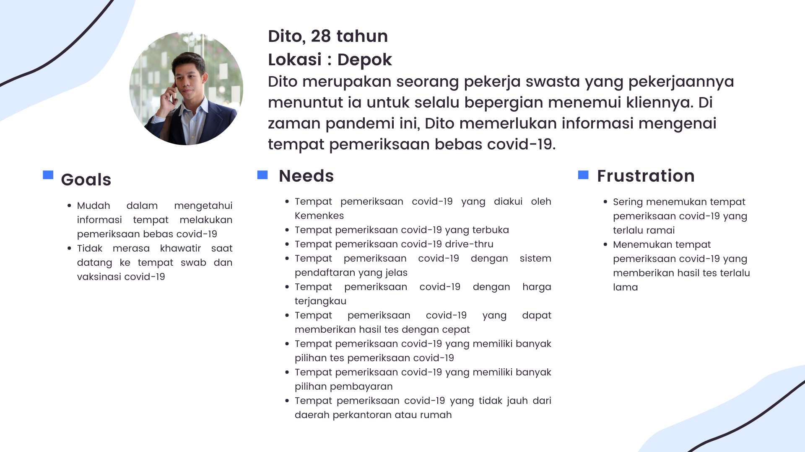
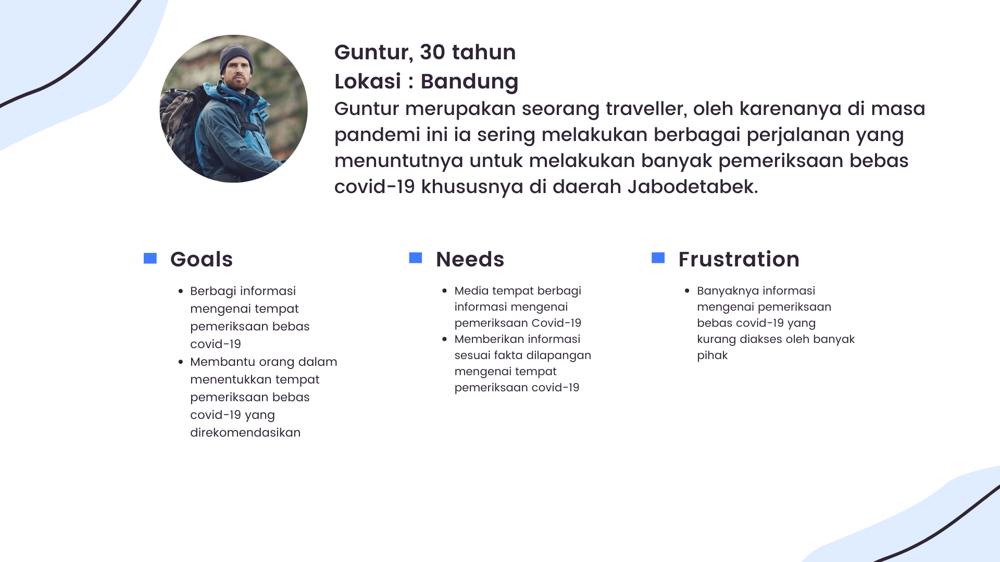
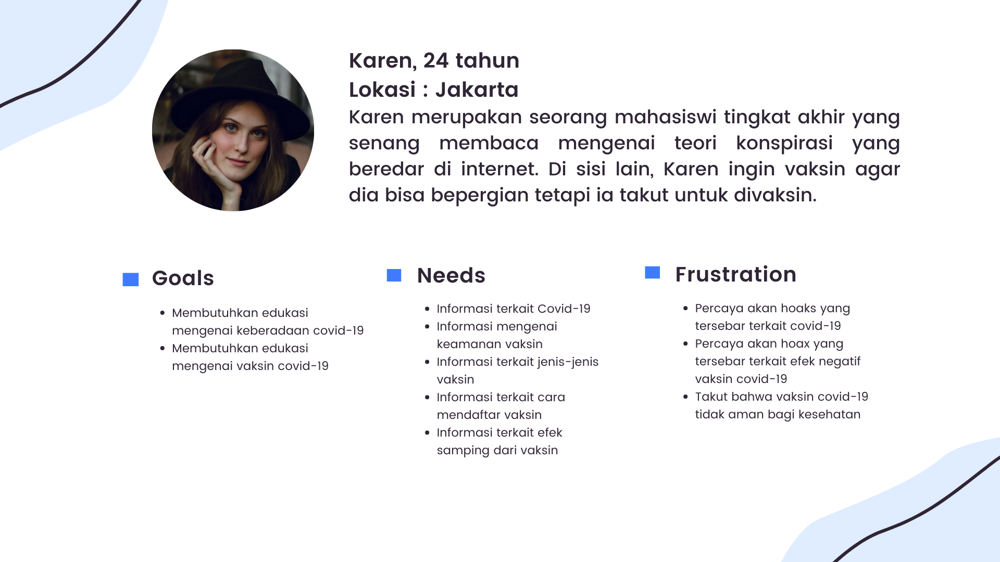

# swab.in-mobile
Main Repository for Swab.in Mobile Version

Nama Anggota Kelompok B10

- Salmadea Fahira Risyani – 2006597355
-	Umar Izzuddin – 2006597424
-	Nyoman Bagus Nuartha Dananjaya – 2006597153
-	Alviona Retno Amalia – 2006597475
-	Paskah Ponchius Kristian – 2006597172
-	M. Faiq Hilmi Musyaffa – 2006597273
-	Fitri 'aliyah – 2006597115

**Story**

Swab.In

**Latar Belakang**  
Mobilitas merupakan kebutuhan dari setiap individu. Namun, di zaman pandemi ini, setiap orang yang akan melakukan mobilitas, khususnya dari satu daerah ke daerah lain dengan  menggunakan transportasi umum memerlukan adanya surat bebas covid-19. Terlebih, masa berlaku surat bebas covid-19 pun umumnya tidak berlangsung lama. Selain itu, vaksinasi merupakan hal yang wajib dilakukan untuk melakukan mobilitas. Dalam hal ini, masalah yang sering dijumpai bagi individu yang ingin melakukan pemeriksaan bebas covid-19 adalah minimnya informasi mengenai tempat pemeriksaan covid-19 yang akan dituju maupun ingin dituju. Selain itu, masalah lain yang ditemui adalah beredarnya berita hoaks mengenai vaksin. Oleh karena itu, diperlukan adanya mobile application yang di dalamnya terdapat fitur-fitur salah satunya seperti forum diskusi sebagai wadah untuk berbagi dan bertanya mengenai tempat pemeriksaan covid-19 dan edukasi mengenai vaksin covid-19.

**Manfaat Mobile Aplikasi Swab.In**  
Membantu pemerintah dalam melakukan edukasi terkait vaksin maupun membantu masyarakat yang ingin melakukan pemeriksaan covid-19 dengan cara memberikan wadah berupa aplikasi mobile berupa fitur ruang diskusi terkait tempat pemeriksaan covid-19 sehingga pengguna dapat membantu satu sama lain terkait informasi suatu tempat covid-19.

| Modul - Modul       | Penjelasan Modul | Cara integrasi web service ke Flutter |
|:---------------------:|:------------------:|:------------------:|
|Halaman Autentikasi  | Berisi form login dan register user                 |Mengirimkan ajax request dari flutter ke database user django untuk melakukan autentikasi

|
|Home         | Berisi konten intro mengenai Swab.In dan informasi cara penggunaan website                                                     | - |
|Daftar Tempat Swab overview (berupa list) |Berisi daftar tempat dan informasi singkat tempat swab, terdapat form (rekomendasi tempat pemeriksaan dari user) |Modul ini akan mengirim data list tempat/lokasi swab ke django melalui JSON untuk ditampilkan di halaman mobile|
|Informasi Detail Tempat Swab dan List Forum |Berisi informasi mengenai nama tempat, lokasi, fasilitas, jam buka tempat swab, dsb beserta list forum dari tempat swab tersebut   |                                             Modul ini akan mengirim data list forum ke database django dan mengambil data informasi tempat swab dari  database django melalui JSON untuk ditampilkan di halaman mobile|
|Forum Diskusi Tempat Swab| Diskusi dan komentar user mengenai tempat swab, user juga bisa saling me-reply komentar satu sama lain | |
|Informasi Vaksin|Informasi tentang vaksin, jenis vaksin, efikasi vaksin, serta efek samping vaksin|Modul ini akan mengambil data Informasi Swab & Vaksin dari database django melalui JSON untuk ditampilkan di halaman mobile. Modul ini juga akan mengirim data pengalaman user saat vaksin atau swab ke database django. |
|Tentang|About us, contact us, terdapat form saran dan masukan|Modul ini akan mengambil data pesan yang diinput oleh user dari database django melalui JSON untuk ditampilkan di halaman mobile

|
|Artikel| Berisi artikel-artikel terkait covid-19 beserta form berisi komentar| |

**User Persona**  
Dalam membangun aplikasi Swab.In ini, kami membuat 3 user persona:  

